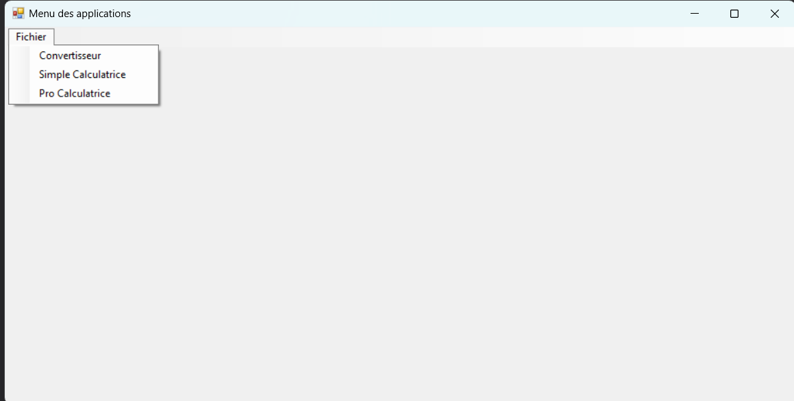
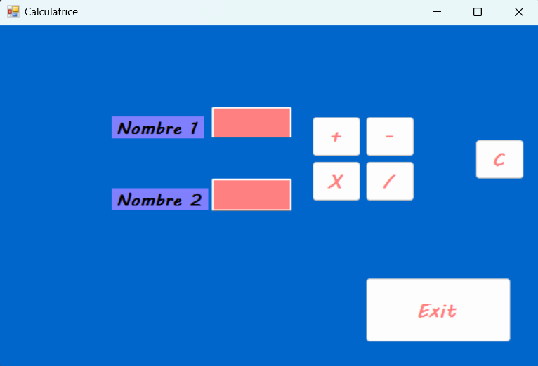
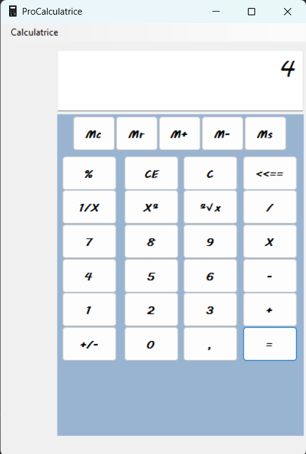
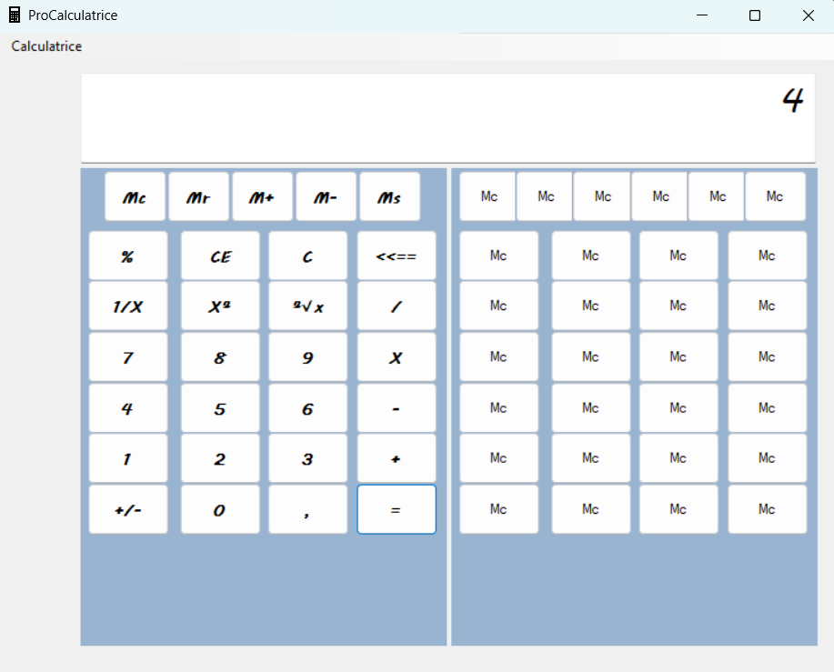
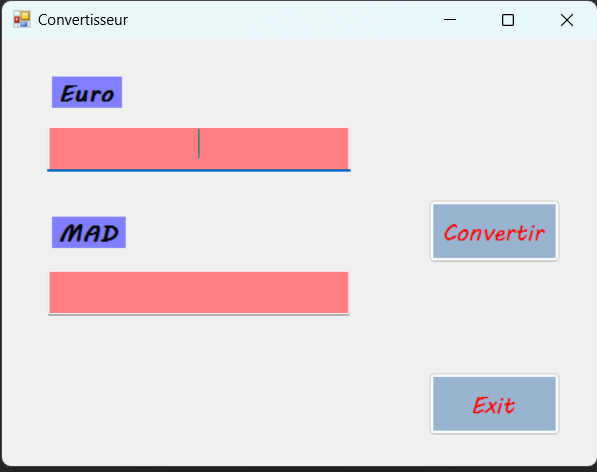

# TP ApplicationMenuDesApp – C# WinForms

Ce projet est un petit **travail pratique réalisé en 1ère année** dans le cadre du cours de programmation C#.  
L’objectif était de créer une application Windows Forms avec un **menu principal** donnant accès à plusieurs petites applications comme :

- une **calculatrice simple**
- une **calculatrice professionnelle**
- un **convertisseur**
- d’autres petites fonctionnalités

C’est un exercice classique pour apprendre les bases de la programmation C#, la structuration d’un projet, la gestion d’événements, et l’utilisation de Windows Forms.

---

## Objectifs du TP

- Comprendre la structure d’un projet **C# WinForms**
- Manipuler des **événements** (boutons, champs, menu…)
- Créer plusieurs **formulaires** et naviguer entre eux
- Implémenter des fonctions simples (calculs, conversions…)
- Apprendre à organiser un projet avec plusieurs classes et écrans

---

## Technologies utilisées

- **C# (.NET)**
- **WinForms**
- Visual Studio

---

## Structure du projet

- `ApplicationMenuDesApp.sln` --> fichier solution  
- `ApplicationMenuDesApp/` --> contient tous les formulaires, classes et ressources  
- Chaque application (calculatrice simple, pro, convertisseur…) possède un **formulaire dédié**

---

## Aperçu de l'application (captures d’écran)

### Menu principal

### Calculatrice debutant

### Calculatrice simple

### Calculatrice professionnelle

### Convertisseur

---

## 👤 Auteur

Projet réalisé par **Soulayman** dans le cadre du TP de programmation C# (1ère année).
